# Javascript Projects

This repository contains a collection of projects that I have worked on while learning Javascript, primarily from following tutorials.

Projects are presented in alphabetical order and include

- Landing Pages
- Games
- Miscellaneous Projects

## Projects

### Gym Landing Page

Made with basic HTML, CSS, and Javascript.

### Inventory Grid

Made with HTML, CSS, and Javascript. Grid design.

### Multiplayer Game

Made with HTML, CSS, and Javascript. Multiplayer game using Firebase.

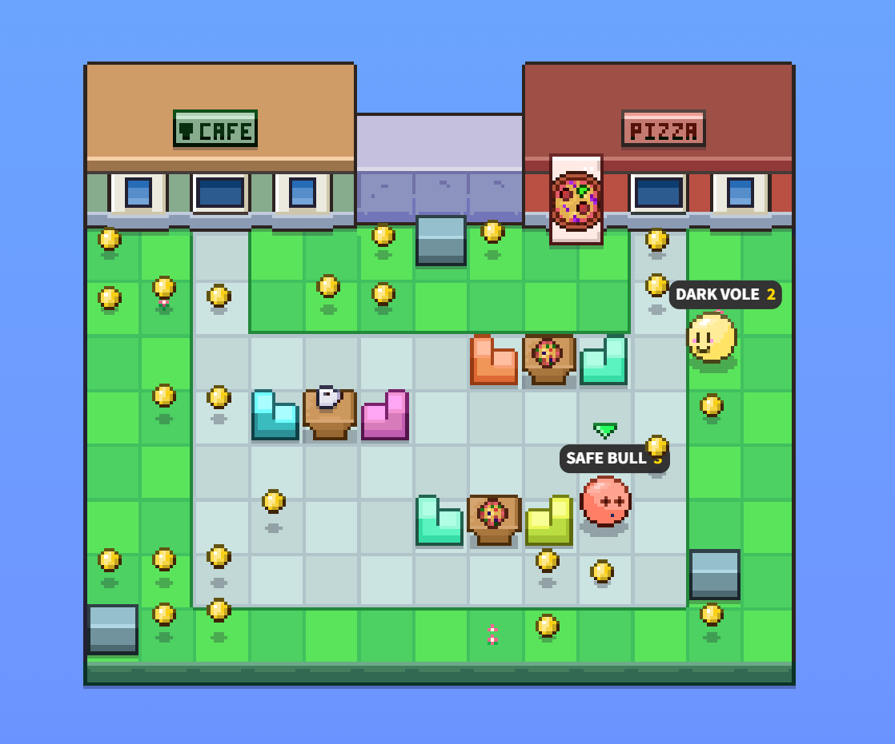
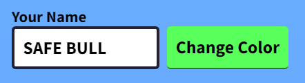

### Navbar Dropdown Mega Menu

Made with HTML, CSS, and Javascript. Dropdown menu.

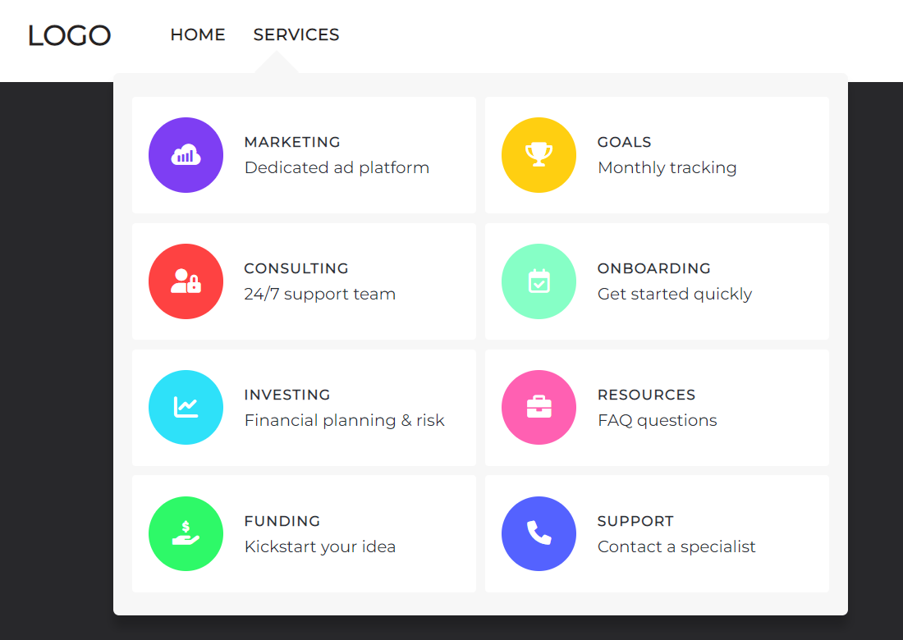

### Pokemon

Made with HTML, CSS, and Javascript. Pokemon game.

Currently working on this project. Bugs to fix.

### Portfolio Site

Made with HTML, CSS, and Javascript. Multiple Themes.

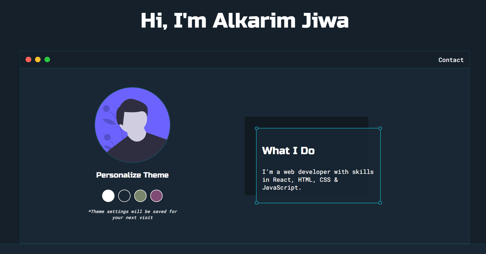

### Sidebar with Dark Mode Toggle

Made with HTML, CSS, and Javascript. Sidebar with dark mode toggle.

<table>
    <tr>
        <td>Sidebar</td>
        <td>Sidebar Expanded</td>
    </tr>
    <tr>
        <td>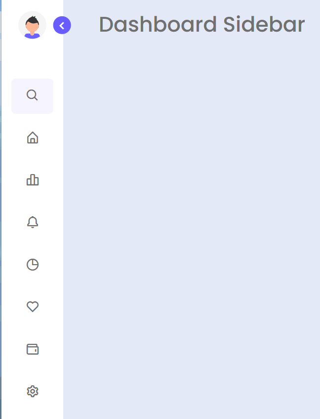</td>
        <td>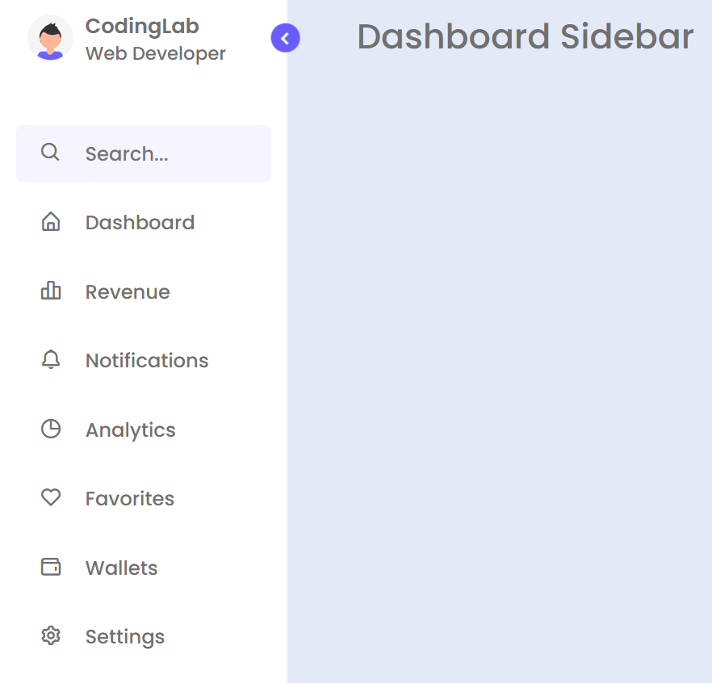</td>
    </tr>
    <tr>
        <td>Dark Mode Toggle</td>
        <td>Sidebar Dark Mode</td>
    </tr>
    <tr>
        <td valign="top">
            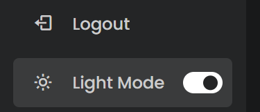
        </td>
        <td>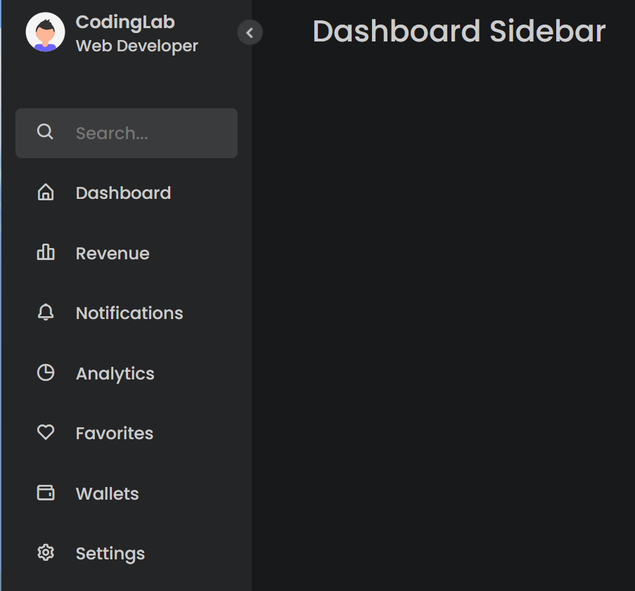</td>
    </tr>
</table>

### Slide Button Animations

Made with HTML, CSS, and Javascript. Slide button animations.

<table>
    <tr>
        <td>Default State</td>
        <td>Slide Left to Right</td>
    </tr>
    <tr>
        <td></td>
        <td>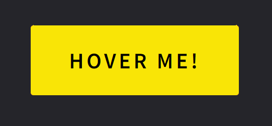</td>
    </tr>
    <tr>
        <td>Default State</td>
        <td>Slide Outwards</td>
    </tr>
    <tr>
        <td valign="top">
            
        </td>
        <td></td>
    </tr>
</table>

### Space Invaders

Made with HTML, CSS, and Javascript. Space Invaders game.

Currently working on this project. Bugs to fix.

### Space Landing Page

Made with HTML, CSS, and Javascript. Space landing page with contact form.

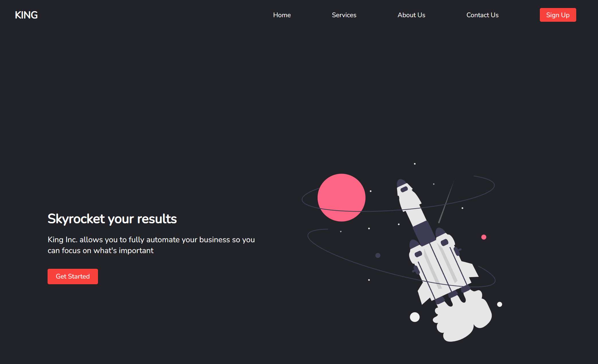

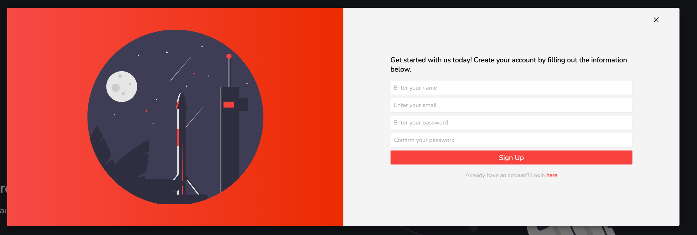

### Tileset Map Editor

Made with HTML, CSS, and Javascript. Tileset map editor.

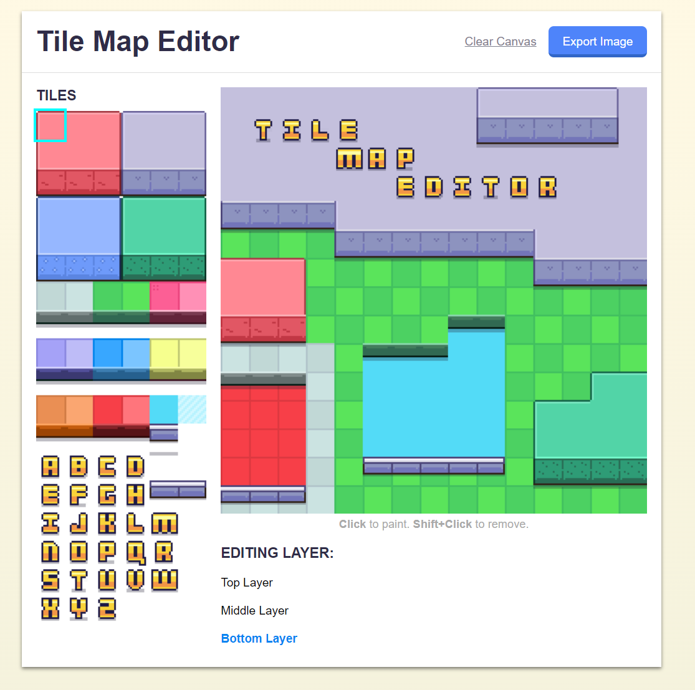

### Top Down Camera

Made with HTML, CSS, and Javascript. Top down camera for 2D RPG games.

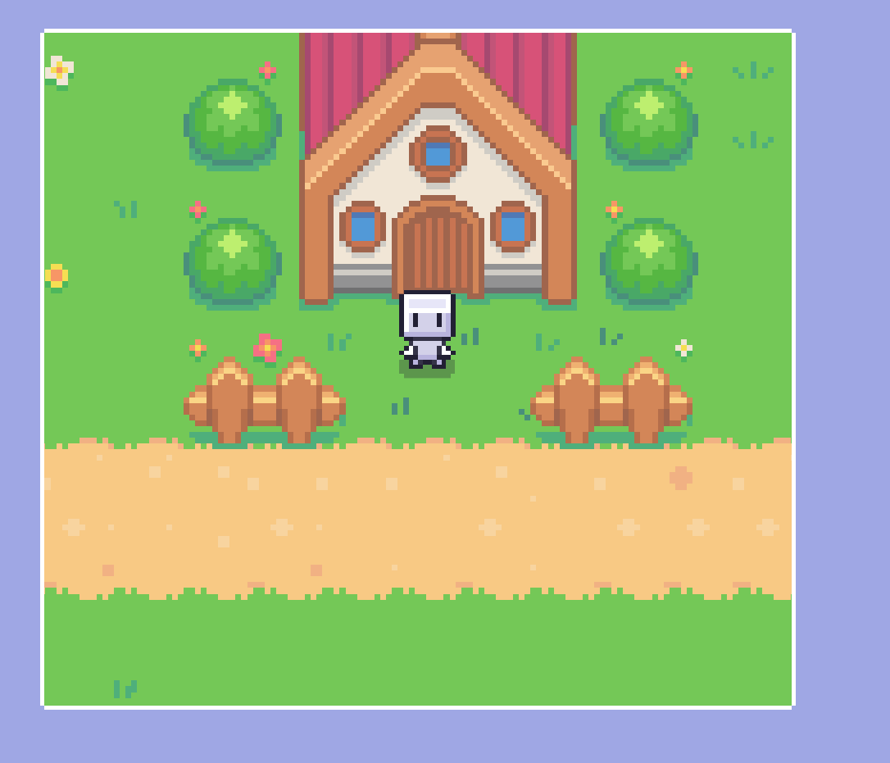

### White Blue Landing Page

Made with HTML, CSS, and Javascript. Landing Page with White and Blue theme.

